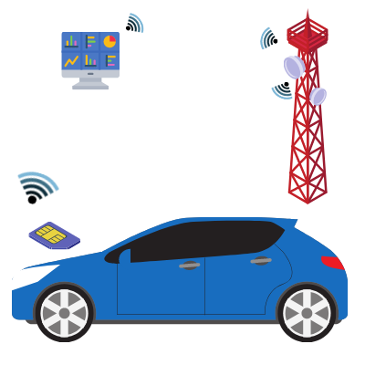
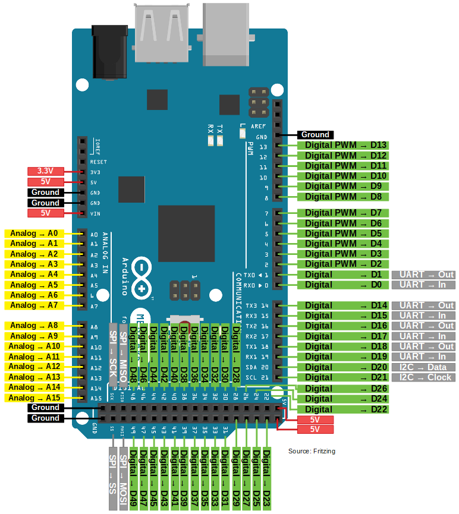
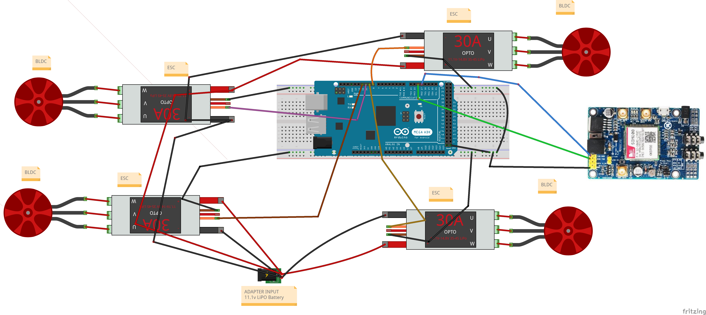
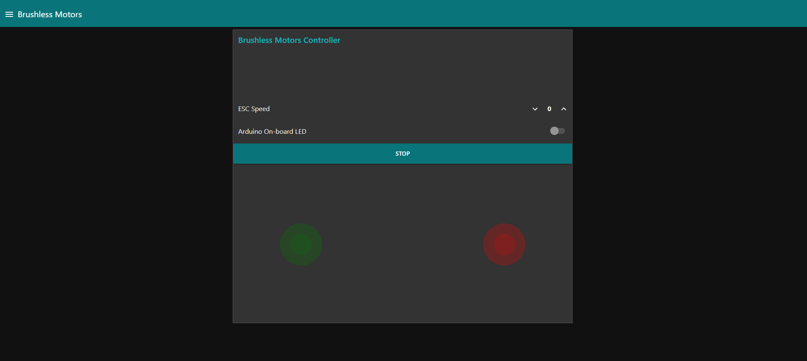

<p align="center">
  <a href="" rel="noopener">
 </a>
</p>

<h3 align="center">Brushless-Motor Wireless Car</h3>

<div align="center">

[]()

</div>

---

<p align="center"> Brushless-Motor Wireless Car
    <br> 
</p>

## 📝 Table of Contents

- [About](#about)
- [Getting Started](#getting_started)
- [Circuit](#circuit)
- [Usage](#usage)
- [List Of Components](#list)
- [Built Using](#built_using)
- [Authors](#authors)

## 🧐 About <a name = "about"></a>

This repo contains

- Firmware
- Detailed instructions

for Brushless-Motor Wireless Car.

## Getting Started <a name = "getting_started"></a>

These instructions will get you a copy of the project up and running on your system.

### Prerequisites

Things you need to install the FW.

```
- Arduino IDE
```

### Installing <a name = "installing"></a>

A step by step series that tell you how to get the Firmware and Backend running

#### ESP32 Configuration

You should have Arduino IDE Installed

1.  Copy the contents of the libs folder to the libraries directory of your Arduino
    1. If you are using windows, the libraries directory will be Documents/Arduino/libraries
2.   Open Arduino IDE.

##### ESP32 Node FW Uploading

1.  Select Arduino Mega or Mega 2560 from Tools->Board->Arduino AVR Boards
2.  Select the correct port from Tools->Port
3.  Then open Firmware.ino file,
4.  Now Upload the Code to your Arduino Mega by pressing CTRL+U
5.  Your Arduino Mega is now ready to be used.

## Circuit <a name = "circuit"></a>

### Arduino Mega Pinout

Follow the pinout diagram given below to connect different components to your Arduino Mega board.



### Circuit



### Pin Connections

```http
Pin connection details
```


#### SIM808

```SIM808 Connections```

| SIM808 Pins | Arduino Mega Pins| 
| :--- | :--- | 
| `TX` | `RX2` |
| `RX` | `TX2` |
| `GND` | `GND` | 

#### ECS

```ECS Connections```

| ECS Pins | Arduino Mega Pins| 
| :--- | :--- | 
| `ESC1 DATA` | `D8` |
| `ESC2 DATA` | `D9` |
| `ESC3 DATA` | `D10` |
| `ESC4 DATA` | `D11` |

* All ESC GND pins should be connected to the Arduino Mega GND pins.


## Usage <a name = "usage"></a>

1.  Open Firmware folder and open networkAPN.h file.
2.  Put your SIM Card APN details in the file. You can get APN details of your SIM card from the website of your network provider.
3.  Open Firmware.ino file.
4.  Upload the code to your Arduino MEGA.
5.  Now connect the battery to the ESCs and use dashboard to move the motors.
6.  Dashbaord Link: https://nodered-proxy.production.wrapdrive.tech/ui/



## List of Components <a name = "list"></a>

Following components are used to make this project

1.  4x ESC
    ○ https://www.amazon.com/RC-Brushless-Electric-Controller-bullet/dp/B071GRSFBD/ref=sr_1_1?keywords=esc&qid=1639564576&sr=8-1

2.  4x Brushless Motors
    ○ https://www.amazon.com/DYS-1300KV-Brushless-Multicopters-Helicopter/dp/B077HLPP4N/ref=sr_1_6?keywords=brushless+motor&qid=1639564659&sr=8-6

3.  Arduino Mega
    ○ https://www.amazon.com/ARDUINO-MEGA-2560-REV3-A000067/dp/B0046AMGW0/ref=sr_1_1?keywords=arduino+mega&qid=1639564701&sr=8-1

4.  11.1v LiPo
    ○ https://www.amazon.com/Airsoft-Battery-Rechargeable-1400mAh-Tamiya/dp/B09G6B1RKB/ref=sr_1_8?keywords=11.1v+lipo&qid=1639564730&sr=8-8

5. 3S LiPo Charger
    ○ https://www.amazon.com/HTRC-Battery-Balancer-Charger-7-4-11-1V/dp/B073WSDCZM/ref=sr_1_8?keywords=lipo%2Bcharger&qid=1639564784&sr=8-8&th=1

6.  5v SIM808 GPRS Module
    ○ https://www.amazon.com/Development-Antenna-Arduino-Raspberry-Support/dp/B07TS7BSP7/ref=sr_1_4?keywords=arduino%2Bgprs&qid=1639565048&sr=8-4&th=1
## ⛏️ Built Using <a name = "built_using"></a>


- [Arduino](https://www.arduino.cc/) - Embedded Framework and IDE - For Sensor Node Design


## ✍️ Authors <a name = "authors"></a>

- [@Nauman3S](https://github.com/Nauman3S) - Development and Deployment
